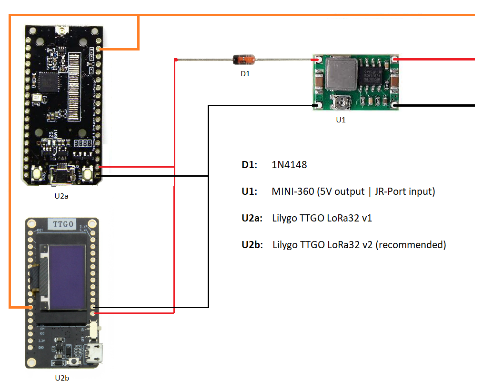

# ExpressLRS_OLED

fork from https://github.com/ExpressLRS/ExpressLRS/tree/pr-oled-support by @brandonRC who initially brought OLED to the IMRC Modules.

The diy 900 tx needs updating the wiring, it's important for upgrades via USB.

